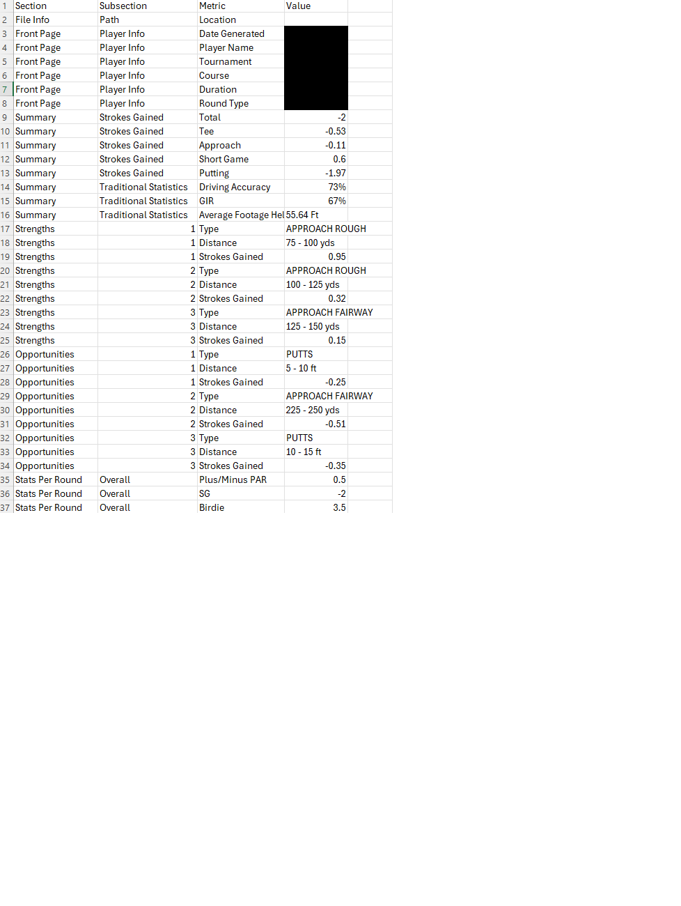
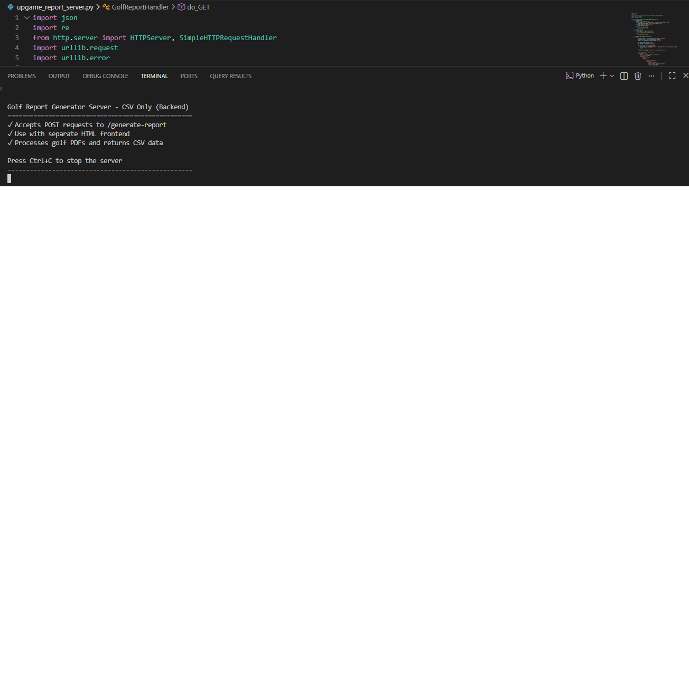

# Golf Performance Pipeline

A full-stack data extraction tool built for the Welsh national golf organisation,
converting Upgame PDF performance reports into structured
CSV files for coaching analysis.

> Built as a client project - source code is private, but the architecture
> and output are documented here.

---

## What it does

Golf coaches receive detailed PDF reports from the Upgame tracking system
covering every aspect of a player's game across multiple rounds. This tool
automates the extraction of that data into a standardised, analysis-ready
CSV format.

**Without this tool:** Coaches manually copy data from PDFs into spreadsheets, slow (7 approx hours per report) , error-prone and inconsistent across reports.

**With this tool:** Upload a PDF, get a structured 472-row CSV in under
two minutes.

---

## Architecture
```
PDF Upload (Frontend)
        ↓
HTML/JS Frontend - drag-and-drop UI, progress bar, file download
        ↓
Python HTTP Server - handles requests, orchestrates pipeline 
        ↓
Claude API - document understanding, structured data extraction
        ↓
CSV Post-Processing - cleaning, formatting, validation
        ↓
CSV Download - browser-native file save dialog
```

## Tech Stack

| Layer | Technology |
|---|---|
| Backend | Python  |
| Frontend | HTML |
| AI / Extraction | Anthropic Claude API |
| Output | CSV (472 rows, consistent structure across all reports) |

---

## Key Features

- Drag-and-drop PDF upload with live animated progress bar
- Consistent 472-row output structure across all reports regardless of PDF variation
- Automated CSV cleaning - handles fraction/percentage formatting and removes extraction artefacts
- Browser-native file save dialog for output
- API key stored locally in browser, never transmitted beyond Claude's servers
- Runs entirely locally - no cloud hosting or external dependencies required

---

## Data Extracted

The tool extracts **472 data points** across 8 major sections per report,
producing a consistent 4-column structure (Section, Subsection, Metric, Value):

| Section | Metrics Extracted |
|---|---|
| **Summary** | Strokes Gained (Total, Tee, Approach, Short Game, Putting), Driving Accuracy, GIR %, Average Footage Held |
| **Strengths / Opportunities** | Top 3 each - shot type, distance range, Strokes Gained value |
| **Stats Per Round** | Plus/Minus PAR, SG, Birdies, Bogeys, Double+ broken down by Par 3/4/5 and each round |
| **Tee Shots** | Driving distance, accuracy, end result breakdown (In Play / Minor / Major / Penalty) by club (Driver, 3W, Other), target zones by distance band |
| **Driver & 3W Dispersion** | 9-zone directional breakdown - Left 30+, 20–30, 10–20, 0–10, Target line, Right 0–10, 10–20, 20–30, 30+ |
| **Approach Shots** | GIR %, Strokes Gained, distance band performance vs PGA Tour average (50–250+ yards), proximity to pin/target by distance band |
| **Short Game** | Strokes Gained, proximity, and shot counts broken down by difficulty (Easy/Medium/Hard) and lie type (Fairway, Rough, Sand) |
| **Putting** | Conversion rates by distance (0–3ft through 25+ft) vs PGA Tour average, Good Putt %, Three Putt %, Strokes Gained by distance band, break performance across 9 putt types |

### Example output (anonymised)

| Section | Subsection | Metric | Value |
|---|---|---|---|
| Summary | Strokes Gained | Total | -2 |
| Summary | Strokes Gained | Putting | -1.97 |
| Summary | Traditional Statistics | Driving Accuracy | 73% |
| Strengths | 1 | Type | APPROACH ROUGH |
| Strengths | 1 | Distance | 75–100 yds |
| Strengths | 1 | Strokes Gained | 0.95 |
| Tee Shots | Overall | Driving Distance | 291.12 |
| Driver Dispersion | Direction | Target line (5Y) | 23.81% |
| Approach Distance Performance | 125–150 | FT | 15.24 |
| Approach Distance Performance | 125–150 | PGA Avg | 23.2 |
| Putting | Conversion 5–10 Ft | Player % | 56.30% |
| Putt Break Performance | R/L | Strokes Gained | -0.78 |

---

## Screenshots

### Upload Interface


### Processing - live progress bar during extraction


### Successful Generation


### CSV Output in Excel (player data redacted)


### Backend Server Running in VS Code


---

## Why Claude API over standard PDF parsing

Standard PDF parsing libraries struggle with Upgame's
report format due to complex multi-column layouts and embedded visual elements.
Using Claude's document understanding API with a carefully engineered structured
extraction prompt produces consistent, validated output that rule-based parsing
cannot reliably achieve.

The prompt engineering required particular care to enforce identical row
structure across reports with varying data availability - missing data
preserves row position rather than shifting subsequent rows, ensuring every
output CSV is directly comparable across players and rounds.

---

## Skills Demonstrated

- Anthropic Claude API integration 
- Python HTTP server built without frameworks
- Structured prompt design for consistent data extraction at scale
- CSV post-processing and data cleaning
- Full-stack development - frontend UI through to backend pipeline
- Client requirements translated into a working, deployed tool
